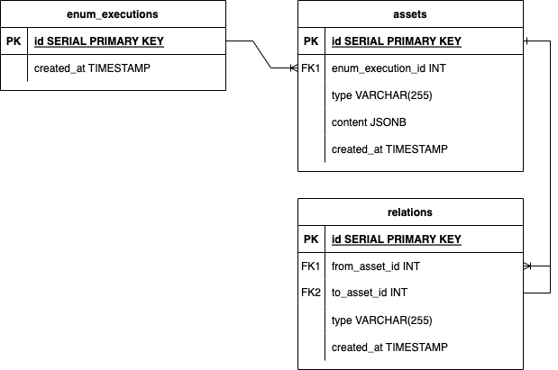

# [ OWASP Amass](https://owasp.org/www-project-amass/) - Amass Evolution

## Database Model

Amass is a widely used tool
in the field of reconnaissance
and enumeration of target networks.
However, one of the limitations of Amass
is its inability to utilize databases
for extensive analysis.
As evolution of Amass involves
implementing new types of enumeration
in the code, such as locations, persons, brands, etc.
it is essential introduce a new model
of data design for Amass,
which will allow for more efficient
and scalable analysis

### Design

The new design of Amass database
will utilize a hybrid approach,
combining a graph-based structure
with a relational database.
This will allow us to take advantage
of the benefits of a graph structures
while also leveraging the features
of a relational database.
To support this new design,
PostgreSQL has been chosen as RDBMS,
based on the community's opinion
and the range of features offered by PostgreSQL
for handling intense amounts of data,
like indexes and the ability
to store JSON as a data type,
which help to achieve scalability
and flexibility in data storage.

The model consists of three main tables:
enum_executions, assets, and relations.



- `enum_executions`: stores all executions of enumerations, all discoveries are associated to an enumeration and allows to compare enumerations.
- `assets`: stores the discoveries made by Amass. Each asset would be a node in the graph representation and contains information about the type of discovery and its content. Postgres allow to store the content in JSON format.
- `relations`: stores the relationships between the discoveries made in the Assets table. It also stores the type of relationship and allows for joins to be performed for SQL queries.

The current asset types in the Amass database model are:

- Fully Qualified Domain Name (FQDN)
- Autonomous System (AS)
- Regional Internet Registry Organization (RIRORG)
- IP Address (IP)
- Netblock

It's worth noting that the model is extensible,
meaning that new asset types can be added
in the future as the tool evolves.

In terms of the relationships,
these help to provide context and structure
to the large amount of data collected by the tool.
By understanding the relationships between assets,
analysts can gain a better understanding
of the network architecture
and potentially identify vulnerabilities or attack paths.
Here's a table summarizing the current relationships
in the Amass database model:

| From Asset | Relation Type | To Asset |
| --- | --- | --- |
| FQDN Asset | `parent_domain` | FQDN Asset |
| Netblock Asset | `contains` | IP Address Asset |
| FQDN Asset | `a_record` | IP Address Asset |
| FQDN Asset | `aaaa_record` | IP Address Asset |
| Autonomous System Asset | `managed_by` | RIR Organization Asset |
| Autonomous System Asset | `announces` | Netblock Asset |

### How to Setup

#### Requirements

Before you begin setting up Amass,
you will need the following software
installed on your system:

- Docker
- Docker Compose
- Go

#### Steps

1.  Navigate to the Amass root directory
in your terminal.

2.  Start the PostgreSQL container
by running the following command:
    ```
    docker-compose up
    ```

3.  Once the container is running,
you can provide your own
database in the `config.ini` file.
Open the file and update the values
of the `[sqldbs.postgres]` section:

| Param | Description |
| --- | --- |
| `primary` | Specifies which SQL database is the primary database, or a local database will be created/selected if no primary database is specified. |
| `database` | The name of the database to connect to. |
| `username` | The username to use when connecting to the database. |
| `password` | The password to use when connecting to the database. |
| `host` | The hostname or IP address of the machine where the database is hosted. |
| `port` | The port number to use when connecting to the database. |
| `migrations_path` | The path to the directory containing the  PostgreSQL migration files. |
| `migrations_table` | The name of the table used to track the migration history. |
| `sslmode` | Specifies whether or not SSL/TLS encryption should be used when connecting to the database. |
| `options` | Additional connection options to be passed to the PostgreSQL server, such as connect_timeout. |

4.  To initialize the database,
run this command in your terminal:

    ```
    amass db init
    ```
    This command creates the necessary tables
    in the database if they don't already exist.
    You only need to run this command once
    or whenever new migrations are added
    to the project.
